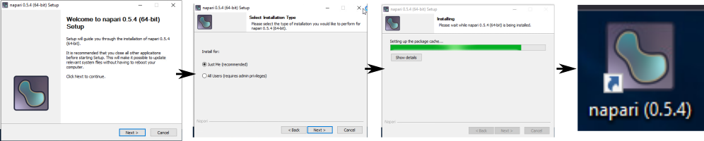
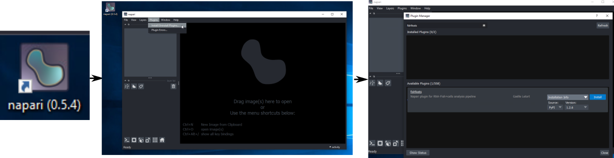

# Installation

EpiCure is a napari plugin. 
Depending on your familiarity with python, you can install it in several ways:

* [In a new virtual environment (recommend)](#from-a-virtual-environment-recommended): Usually, each plugin is installed in its own python environment to avoid compatibility issues of its dependencies. Below, we detailled all the installation steps so that anybody could perform this installation.

* [In already installed Napari](#from-napari-interface): if you already have an environement with napari installed, and are not afraid of compatibility issues, you can directly use it and add EpiCure to it.

* [In a full graphical way](#with-graphical-interface): if you are unconfortable with the installation of a virtual environment, there is a possibility to do all the installation through graphical interfaces.  


## From Napari interface
EpiCure is a Napari plugin, in python. 
You can install it through an already installed Napari instance by going in Napari to `Plugins>Install/Uninstall`, search for `Epicure` and click `Install`.
You could have version issues between the different modules installed in your environment and EpiCure dependencies, in this case it is recommended to create a new virtual environnement specific for EpiCure.


## From a virtual environment (recommended)

To install EpiCure in a new environnement, you should create a new virtual environnement or activate an exisiting compatible one.

### Step 1 : install a Python management package (if you don't have one already). 
You have different options, but you have to choose one:  

- Miniforge (**recommended**): fast, free but no interface. Follow the detailled steps here to [install miniforge](https://kirenz.github.io/codelabs/codelabs/miniforge-setup/#0)
- venv: fast and simple install in general, no interface. See [tutorial here](https://www.geeksforgeeks.org/create-virtual-environment-using-venv-python/)
- Mamba: fast, free but no interface. See [here](https://informatics.fas.harvard.edu/resources/tutorials/installing-command-line-software-conda-mamba/)
- Anaconda: a sort of interface, works well on MacOS and Windows but slow and might not stay free to all. See here: [on windows](https://www.geeksforgeeks.org/how-to-install-anaconda-on-windows/), [on macOS](https://www.geeksforgeeks.org/installation-guide/how-to-install-anaconda-on-macos/?ref=ml_lbp) or [on linux](https://www.geeksforgeeks.org/how-to-install-anaconda-on-linux/) ). 
 
### Step 2 : Create a virtual environment with that python management package. 
Once you have installed such Python management package, they generally create one environment called `base` but you should not install anything in that environment.  

- You need to create an environment where you will install EpiCure. To do so you first open the terminal (activated in the `base` environment), and type: 
```
    conda create -n epicurenv python=3.10
``` 
It will install python 3.10 and create an environment called `epicurenv`. 
Since Epicure 1.5, you can use other versions of python (it was tested on 3.11 and 3.12).

!!! note "Python version"
	To segment within EpiCure, you can use Epyseg, that is limited to python 3.10 and relies tensorflow. To avoid possible conflict and not limit epicure to python 3.10, EpiCure creates another virtual environement for epyseg thanks to [Appose](https://github.com/apposed/appose). The first time you use this option, it will take more time as it has to install the new environement.


### Step 3: Install EpiCure 
Once you have created/identified a virtual environnement, type in the terminal:
``` 
conda activate epicurenv
```
to activate it (and start working in that environnement).

Type in the activated environnement window:

```
pip install epicure 
```
to install EpiCure with its dependencies.

!!! note "PyQt version"
    From EpiCure version 1.5.5, the default backend installation will be PyQt6, following napari's default installation (see [here](https://napari.org/dev/getting_started/installation.html#choosing-a-different-qt-backend)). If you need PyQt5 instead, epicure can be installed as `pip install epicure[pyqt5]`. You might have to also force napari installation to PyQt5 `pip install napari[pyqt5]`. If necessary, remove PyQt6 librairies and set QT_API to pyqt5. See also this [issue](https://github.com/Image-Analysis-Hub/Epicure/issues/13).

### Step 4: Open napari and start using EpiCure
You can open napari by writing `napari` in the terminal. 
It is often slow to open the first time but that’s it. 

You can start EpiCure by going in `Plugins>EpiCure>Start Epicure` and follow the [Usage online documentation](./Start-epicure.md) to know how to use it.


## With graphical interface 

### Step 1: Napari installation through a graphical interface

Download the bundle version of napari : [https://napari.org/stable/getting_started/installation.html#installation-bundle-conda](https://napari.org/stable/getting_started/installation.html#installation-bundle-conda)

The installation steps are detailled for each OS in the same webpage.

Double-click on the executable.
It will open an installer program, that you can simply follow step by step.
You can keep all the default options that are proposed by the installation program.
When the installation is finished (it takes some time), a shortcut icon should have been created in your desktop.




### Step 2: EpiCure installation through a graphical interface
When the installation is over, double-click on the napari icon and wait for napari window to open (it can take a few minutes). 
When napari is open, go to `Plugins>Install/Uninstall` to open the plugin manager.
In the window that appears, search for `epicure` and click Install.
Wait for the installation to finish (it takes some time), and restart napari.



If you want to install a specific version of EpiCure, click on `Installation info` to get the list of available versions.
**Restart napari after the plugin installation**.

### Step 3: Use EpiCure from Napari
Open Napari by double-clicking on the icon created by the installation in step 1.

In the napari window, start EpiCure by going in `Plugins>EpiCure>Start Epicure` and follow the [Usage online documentation](./Start-epicure.md) to know how to use it.

??? tip "Updating some dependencies version"
	If you need to change some dependencies version, you can do so by opening the napari Terminal by clicking the icon :material-console-line: at the bottom left of the napari window. Then write `pip install modulename==versionnumber` to install the `modulename` library with the given version number.

